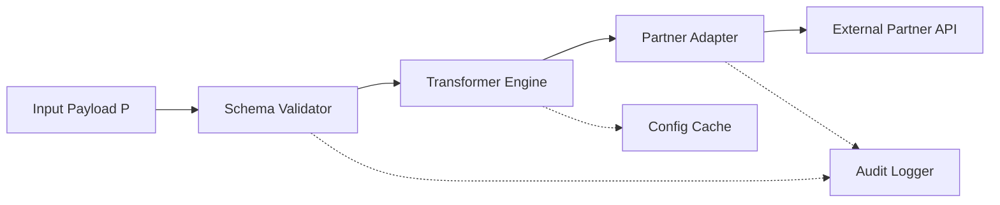
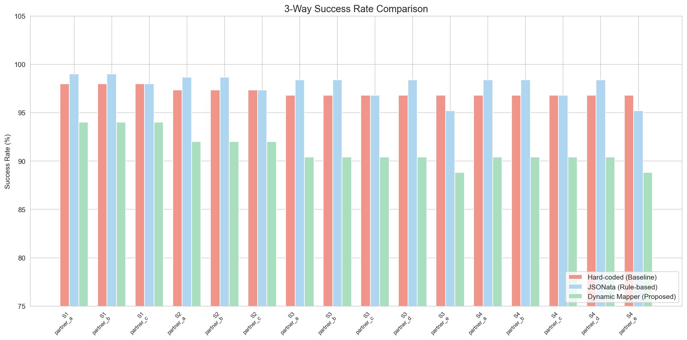
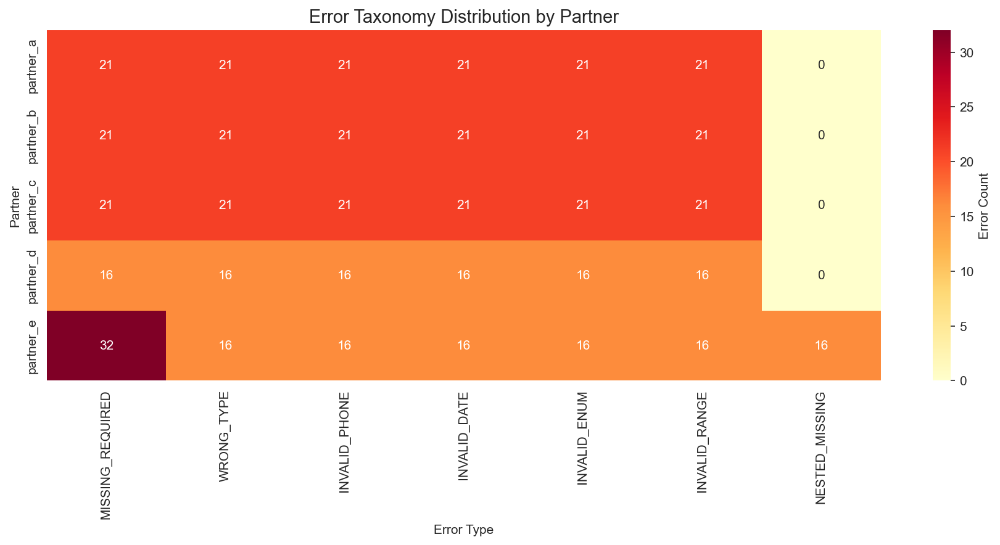
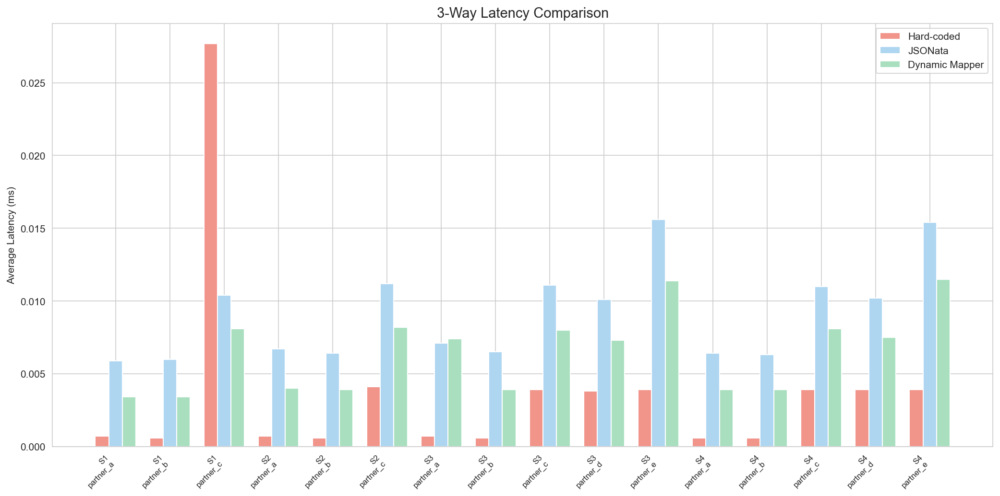
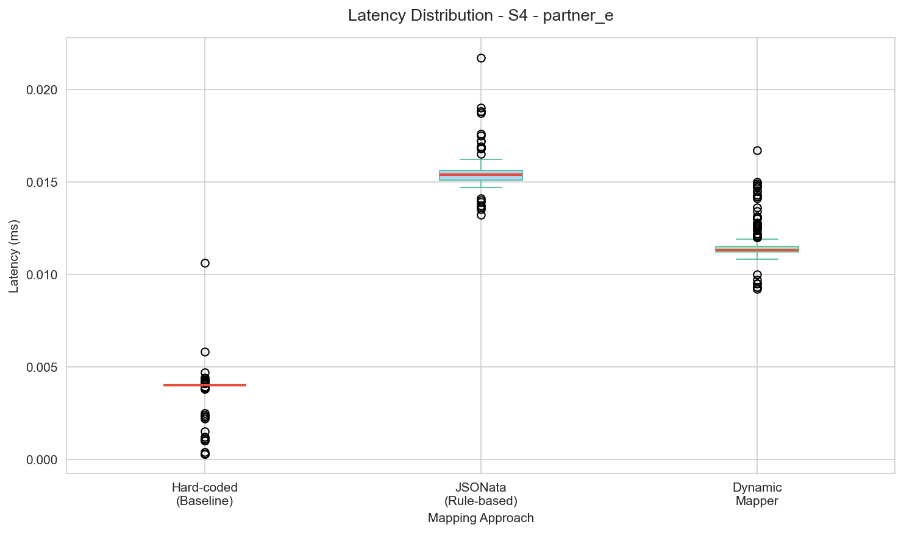

# Design and Evaluation of a Configuration-Based Dynamic Message Mapper for Multi-Partner REST API Integration

Harrison Antonio .H*1

1Program Studi Teknik Informatika, Universitas Nusa Cendekia, Kupang, Indonesia

E-mail: harrison@example.com

---

**Abstract.** Integration of REST APIs across multiple external partners presents a persistent challenge in modern software development, particularly in logistics platforms where each shipping partner enforces distinct payload formats, naming conventions, and validation rules. This study designed and evaluated a configuration-based dynamic message mapper that consolidates field mapping, data transformation, schema validation, partner adaptation, configuration caching, and audit logging into a lightweight prototype. Following Design Science Research Methodology (DSRM), controlled experiments evaluated the artifact across four scenarios (S1–S4) comparing three approaches: hard-coded Python, a JSONata-style rule-based baseline, and the proposed dynamic mapper. The dynamic mapper achieved 100% mapping accuracy on valid payloads, equivalent to both baselines, while attaining an error detection rate of 85.7%–100% on invalid payloads, exceeding hard-coded (28.6%) and JSONata-style baselines (14.3%–42.9%) with a false positive rate of 0%. Seven error types were detected: missing required, wrong type, invalid phone, invalid date, invalid enum, invalid range, and nested field missing. External validation against Shippo Test Mode (201 Created), httpbin.org, and Postman Echo confirmed real-API functionality. End-to-end benchmarking under 50 concurrent users achieved throughput of 1,196 req/s with p50 latency of 34.54 ms and zero errors. Latency differences were significant (p < 0.001) but practically negligible in absolute terms (mean overhead +0.004 ms in-process). These findings show that declarative configuration approaches can deliver validation and error detection capabilities unavailable in conventional approaches without sacrificing mapping accuracy.

**Keywords:** message mapper, REST API, multi-partner integration, JSON transformation, schema validation, declarative configuration, design science research

---

## 1. Introduction

REST API integration with external services has become a fundamental requirement in enterprise software development [1], [2]. In logistics and e-commerce contexts, platforms must connect with dozens of shipping partners, each enforcing distinct payload formats, field naming conventions (snake_case vs. camelCase), nested structures, and validation rules [3]. This heterogeneity creates significant technical burden: every new partner requires manually written mapping code, separate validation testing, and documentation updates, and increased defect rates [4].

The prevailing approach, hard-coded mapping, embeds transformation logic directly in source code for each partner. While straightforward, this approach has fundamental weaknesses: each new partner requires a new mapper function (~40 lines of code), payload validation is performed separately from mapping logic, no integrated caching or audit logging exists, and partner specification changes require application redeployment. An alternative uses transformation rule engines such as JSONata [5] or JOLT (Apache NiFi [6]), which define transformations declaratively. These tools, however, lack integrated schema validation, caching, or audit logging, features critical in multi-partner production environments [7].

This study proposed a **configuration-based dynamic message mapper**, a prototype integrating field mapping, data transformation, schema validation (seven error types), partner adaptation, TTL-based configuration caching, and audit logging into a single lightweight system. The novelty lies in designing and evaluating a system where new partners can be onboarded through JSON configuration without modifying core source code, provided configurations are loaded at runtime (via file watcher or API reload), eliminating redeployment. Unlike prior work focusing on transformation or validation separately, this study evaluates their integration within a single artifact and compares it against two baselines: hard-coded (representing common developer practice) and a JSONata-style baseline (representing existing rule-based transformation, implemented in Python with equivalent expression patterns). The evaluation extends beyond simulation data through external validation against public/sandbox APIs (Shippo, httpbin, Postman Echo).

Four research questions (RQ) guide this study:

- **RQ1**: How to design a configuration-based dynamic message mapper architecture for multi-partner REST API integration?
- **RQ2**: How accurate is the dynamic mapper in transforming payloads compared to hard-coded and rule-based mappers?
- **RQ3**: How effective is the dynamic mapper at detecting payload errors before requests reach partner APIs?
- **RQ4**: What is the impact of the dynamic mapper on latency, throughput, and maintainability in controlled experiments and external API validation?

Contributions include: (1) a configuration-based dynamic message mapper artifact with integrated validation; (2) a quantitative three-way evaluation across four scenarios with seven error types; (3) external validation against public REST APIs; and (4) empirical evidence that declarative configuration approaches can provide error detection capabilities unavailable in conventional approaches.

## 2. Related Work

Multi-partner REST API integration concerns a system's ability to communicate with multiple external services that enforce different API contracts, encompassing heterogeneous data formats, naming conventions, payload structures (flat vs. nested), and validation rules [8], [9], [3]. Within microservice architectures, the API Gateway and Adapter patterns address this heterogeneity, though implementations generally require manual coding per partner endpoint [2], [12]. The Message Mapper, an enterprise integration pattern that transforms messages between differing formats without modifying sender or receiver business logic, remains foundational across enterprise service buses (ESB), API gateways, and iPaaS [3]. Recent research confirms its continued relevance in cloud-native contexts, where modern API gateways provide payload transformation through declarative configuration [2].

Two widely-adopted transformation rule engines are JSONata, an expression language for JSON query and transformation with path navigation and built-in functions [5], and JOLT, a JSON transformation library within Apache NiFi [6]. Both provide declarative data transformation but lack integrated schema validation, configuration caching, and audit logging. Payload validation prior to partner API dispatch is recommended: Barakat and Segura [7] demonstrated that gateway-level validation reduces response time for invalid API calls by up to 59%. This confirms the urgency of integrated validation; however, no prior work has evaluated multi-type error validation within a unified mapping system, the gap this study addresses.

This study employs Design Science Research Methodology (DSRM), a six-step framework for artifact creation and evaluation [10]: problem identification, solution objectives, design and development, demonstration, evaluation, and communication. Plachkinova and Vo [11] criticized that many DSR artifacts are evaluated solely through illustrative scenarios without quantitative testing. Responding to this critique, the evaluation herein encompasses controlled three-way experiments, comprehensive statistical testing, external public API validation, and end-to-end benchmarking.

## 3. Research Method

### 3.1 DSRM and Experimental Design

This study follows the six DSRM steps [10]. Step 1 identifies the problem of payload format heterogeneity across partner REST APIs. Step 2 establishes the objective: designing a configuration-based dynamic message mapper. Step 3 constructs the prototype (see Section 4). Step 4 demonstrates the mapper on five simulated partners. Step 5 evaluates through controlled experiments, external validation, and end-to-end benchmarking. Step 6 communicates findings through this article.

The experiment was designed as a controlled experiment with three mapping approaches as independent variables: (1) Hard-coded Python, five separate mapper functions (248 LOC), manual validation; (2) JSONata-style baseline, Python-based rulesets (314 LOC) implementing JSONata expression patterns (`$.path`, `$fn($.path)`) with equivalent built-in functions, no integrated validation; (3) Proposed Dynamic Mapper, per-partner JSON configuration, 555 LOC core engine encompassing transformer, validator, adapter, cache, and logger. Dependent variables include mapping accuracy (%), error detection rate (%), latency (ms), throughput (req/s), and config complexity (LOC, files changed). Control variables include the payload dataset, partner specifications, and execution environment.

### 3.2 Formal Mapping Model

The mapping process is formally modeled as a transformation function:

$$M(P, R) \rightarrow (P', E_v, E_t)$$

where $P$ is the input payload in internal format, $R = \{r_1, r_2, ..., r_n\}$ is the set of mapping rules, $P'$ is the output payload in partner format, $E_v$ is the set of validation errors, and $E_t$ is the set of transformation errors. Each rule $r_i$ is defined as a tuple:

$$r_i = (s_i, t_i, f_i, \rho_i, \delta_i, \tau_i, \kappa_i)$$

with $s_i$ = source field (supporting dot-notation for nested paths), $t_i$ = target field, $f_i$ = optional transformation function, $\rho_i$ = required flag, $\delta_i$ = default value, $\tau_i$ = expected type, and $\kappa_i$ = validation constraints (min_value, max_value, enum, pattern, validate_phone, validate_date). An error $e \in E_v$ occurs when $\exists r_i \in R$ such that $\rho_i = true \land s_i \notin P$, or the value at $s_i$ violates $\tau_i$ or $\kappa_i$. An error $e \in E_t$ occurs when $f_i$ fails execution on $s_i$.

### 3.3 Dataset and Scenarios

The dataset consists of logistics transaction payloads generated using the Faker library with a fixed seed (random seed = 42). Each payload contains required fields (order_id, customer_name, customer_phone, address, weight, created_at, courier), optional fields (item_name, quantity, price, notes), and a nested `recipient` object containing name, phone, and nested `address` (street, city, region, postal_code). The dataset is divided into four scenarios as presented in Table 1.

**Table 1.** Test scenarios

| Scenario | Partners | Total Payloads | Clean | Invalid | Field Count |
|:--------:|:--------:|:--------------:|:-----:|:-------:|:-----------:|
| S1 | 3 (A,B,C) | 100 | 93 | 7 | 10 |
| S2 | 3 (A,B,C) | 300 | 272 | 28 | 15 |
| S3 | 5 (A–E) | 500 | 444 | 56 | 20 |
| S4 | 5 (A–E) | 500 | 444 | 56 | 30 |

### 3.4 Simulated Partners

Five simulated partners were designed to represent payload format variations commonly encountered in real-world REST API integration (Table 2).

**Table 2.** Simulated partner characteristics

| Partner | Characteristics | Mapping Rules |
|---------|----------------|:-------------:|
| A | Flat JSON, snake_case, basic validation | 11 |
| B | Flat JSON, camelCase, phone + enum validation | 11 |
| C | Nested JSON (2-level), kg-to-gram transform, enum validation | 11 |
| D | Date format dd/mm/yyyy, phone +62, range validation | 11 |
| E | Complex nested JSON (3-level), 10 required fields, all 7 validations | 15 |

### 3.5 Error Injection Design

Errors were injected following a **one payload, one error** rule: each injected payload contains exactly one error type, enabling clear attribution of detection to each error type without overlap. In S4, out of 500 total payloads, 444 are clean payloads (no injection) and 56 are invalid payloads, 8 payloads per error type for 7 error types (Table 3). Invalid payload positions are randomly shuffled within the dataset to prevent ordering bias.

**Table 3.** Error taxonomy and injection design (7 types, 8 payloads per type)

| Error Code | Description | Injection Example |
|-----------|-------------|-------------------|
| MISSING_REQUIRED | Required field absent | `customer_name` removed |
| WRONG_TYPE | Incorrect data type | `weight = "not_a_number"` |
| INVALID_PHONE | Invalid phone format | `customer_phone = "invalid_99999"` |
| INVALID_DATE | Invalid date format | `created_at = "2026-June-22"` |
| INVALID_ENUM | Value outside allowed enum | `courier = "UNKNOWN"` |
| INVALID_RANGE | Value outside min/max bounds | `weight = -0.5` |
| NESTED_MISSING | Nested object field absent | `recipient.address.city` removed |

### 3.6 Evaluation Metrics

Mapping accuracy measures the percentage of clean payloads successfully transformed without errors. Error detection rate measures the percentage of invalid payloads where at least one error is detected. False positive rate measures the percentage of clean payloads incorrectly flagged. Latency is measured at the in-process level (pure transformation time) and end-to-end (HTTP request-response time). Config complexity uses proxy metrics, lines of code (LOC), number of files changed when adding a new partner, and estimated onboarding time, as indirect indicators of maintainability, since an observational study with real developers has not yet been conducted.

### 3.7 Statistical Analysis

Shapiro-Wilk normality tests determine the choice between paired t-tests (normal data) and Wilcoxon signed-rank tests (non-normal data). Effect size is calculated using Cohen's d: trivial (<0.2), small (0.2–0.5), medium (0.5–0.8), large (>0.8). Tests are conducted for each pair of approaches across every scenario and partner.

## 4. System Design and Implementation

The dynamic message mapper architecture comprises five core components interacting within a transformation pipeline (Figure 1). The **Transformer Engine** accepts internal payload $P$ and mapping rules $R$, producing output payload $P'$ through field renaming, nested mapping (dot-notation), and transformation functions $f_i$. Ten built-in transformation functions are provided: `normalize_phone` (0812xxx to 62812xxx), `kg_to_gram`, `gram_to_kg`, `yyyy_mm_dd_to_dd_mm_yyyy`, `yyyy_mm_dd_to_dd_slash_mm_slash_yyyy`, `to_uppercase`, `to_lowercase`, `to_string`, `to_number`, and `to_boolean`. The **Schema Validator** evaluates each rule $r_i$ against input payload $P$ to produce $E_v$ through seven inspection types, implementing type-failed tracking, fields that fail type validation bypass subsequent range validation to prevent error double-counting. The **Partner Adapter** abstracts HTTP dispatch, supporting partner-specific API key headers. The **Configuration Cache** uses TTL-based in-memory storage with a thread-safe lock. The **Audit Logger** records $P$, $P'$, $E_v$, $E_t$, status, and latency to the database.

**Figure 1.** Dynamic Message Mapper architecture

## 5. Results and Discussion

### 5.1 Mapping Accuracy and Error Detection

Mapping accuracy was measured exclusively on clean payloads (444 payloads in S4). Across all scenarios, all three approaches achieved 100% accuracy (Table 4, Figure 2). The dynamic mapper produced zero false positives, no clean payload was incorrectly flagged. These findings confirm that the declarative configuration approach does not sacrifice mapping accuracy (RQ2).

**Table 4.** Mapping accuracy on clean payloads (S4, 444 payloads)

| Partner | Hard-coded (%) | JSONata-style (%) | Dynamic Mapper (%) |
|---------|:--------------:|:-----------------:|:------------------:|
| A | 100.0 | 100.0 | 100.0 |
| B | 100.0 | 100.0 | 100.0 |
| C | 100.0 | 100.0 | 100.0 |
| D | 100.0 | 100.0 | 100.0 |
| E | 100.0 | 100.0 | 100.0 |
| **Mean** | **100.0** | **100.0** | **100.0** |

**Figure 2.** Three-way success rate comparison across all scenarios and partners

Error detection rate was measured on 56 invalid payloads (S4). The dynamic mapper achieved 85.7% on Partners A–D and 100% on Partner E, surpassing hard-coded (28.6%) and JSONata-style (14.3%–42.9%) as presented in Table 5. Hard-coded detected only MISSING_REQUIRED (manual required-field checks) and partial WRONG_TYPE (exception handling). The JSONata-style baseline detected MISSING_REQUIRED via the `required` flag and fields failing transformation functions. The dynamic mapper detected all seven error types through its integrated validator (RQ3).

**Table 5.** Error detection rate on invalid payloads (S4, 56 payloads)

| Partner | Hard-coded (%) | JSONata-style (%) | Dynamic Mapper (%) |
|---------|:--------------:|:-----------------:|:------------------:|
| A | 28.6 | 14.3 | 85.7 |
| B | 28.6 | 14.3 | 85.7 |
| C | 28.6 | 28.6 | 85.7 |
| D | 28.6 | 14.3 | 85.7 |
| E | 28.6 | 42.9 | **100.0** |
| **Mean** | **28.6** | **22.9** | **88.6** |

The distribution of detected errors in S4 is presented in Table 6 and Figure 3. The lower count for NESTED_MISSING (8) is because only Partner E has nested validation rules; Partners A–D lack dot-notation source fields, so this error type is not detected on those partners, consistent with the injection design where each error is only relevant to partners that have corresponding validation rules.

**Table 6.** Error taxonomy distribution (S4, all partners)

| Error Type | Detected Count | Percentage |
|------------|:--------------:|:----------:|
| MISSING_REQUIRED | 48 | 18.8% |
| WRONG_TYPE | 40 | 15.6% |
| INVALID_PHONE | 40 | 15.6% |
| INVALID_DATE | 40 | 15.6% |
| INVALID_ENUM | 40 | 15.6% |
| INVALID_RANGE | 40 | 15.6% |
| NESTED_MISSING | 8 | 3.1% |
| **Total** | **256** | **100%** |

**Figure 3.** Error taxonomy heatmap per partner (S4)

### 5.2 Latency and Throughput Analysis

In-process latency in S4 showed all three approaches operating below 0.015 ms, with hard-coded being fastest (0.0006–0.0039 ms), followed by the dynamic mapper (0.0038–0.0109 ms), and JSONata-style (0.0063–0.0148 ms), see Table 7 and Figure 4. The dynamic mapper's validation overhead (~0.003 ms) is practically negligible since network latency dominates real REST API requests.

**Table 7.** In-process latency comparison (S4)

| Partner | Hard-coded (ms) | JSONata-style (ms) | Dynamic Mapper (ms) | Delta DM vs HC (ms) |
|---------|:---------------:|:------------------:|:-------------------:|:-------------------:|
| A | 0.0006 | 0.0063 | 0.0038 | +0.0032 |
| B | 0.0006 | 0.0064 | 0.0038 | +0.0032 |
| C | 0.0037 | 0.0102 | 0.0076 | +0.0039 |
| D | 0.0036 | 0.0099 | 0.0071 | +0.0035 |
| E | 0.0039 | 0.0148 | 0.0109 | +0.0070 |
| **Mean** | **0.0025** | **0.0095** | **0.0066** | **+0.0042** |

**Figure 4.** Three-way in-process latency comparison across all scenarios and partners

End-to-end benchmarking against a locally running FastAPI server yielded the results in Table 8. At 10 concurrent users, the dynamic mapper achieved p50 latency of 3.83–4.42 ms with throughput of approximately 800 req/s. At 50 concurrent users, p50 increased to 34.54 ms, p95 to 56.79 ms, and throughput to 1,196 req/s. Error rate remained at 0% across all configurations. These results warrant further evaluation on cloud/production environments to validate performance under distributed load (RQ4).

**Table 8.** End-to-end REST API benchmark results

| Configuration | p50 Latency (ms) | p95 Latency (ms) | Throughput (req/s) | Error Rate (%) |
|---------------|:----------------:|:----------------:|:------------------:|:--------------:|
| 100 req, 10 concurrent | 4.42 | 6.30 | 776.32 | 0.0 |
| 500 req, 10 concurrent | 3.83 | 5.30 | 824.91 | 0.0 |
| 500 req, 50 concurrent | 34.54 | 56.79 | 1,196.33 | 0.0 |

### 5.3 External Validation

External validation against public/sandbox REST APIs confirmed real-API functionality (Table 9). Shippo Test Mode successfully accepted a shipment creation request (201 Created). httpbin.org and Postman Echo verified correct payload and header echoing. RajaOngkir was unreachable from the test network (timeout), documented as a network limitation, not a mapper failure.

**Table 9.** External API validation results

| API | Endpoint | Status | Latency (ms) | Outcome |
|-----|----------|:------:|:------------:|---------|
| Shippo Test Mode | POST /shipments | OK (201) | 1,418.96 | Schema parsed, object_id returned |
| RajaOngkir Starter | POST /cost | Timeout | 30,103.50 | Network unreachable* |
| httpbin.org | POST /post | OK (200) | 9,711.75 | Payload echoed correctly |
| Postman Echo | POST /post | OK (200) | 501.72 | Payload echoed correctly |

> *Test network limitation; documented as an external validity threat.

### 5.4 Config Complexity (Proxy Maintainability Analysis)

Maintainability was analyzed through proxy metrics, LOC, files changed, and estimated onboarding time, since an observational study with real developers has not yet been conducted (Table 10). The dynamic mapper requires a 555 LOC core engine, but per-partner configuration is a declarative JSON file (~90 lines) that can be created without programming expertise. Estimated onboarding time: 18–40 minutes (dynamic mapper), 25–50 minutes (JSONata-style), 45–95 minutes (hard-coded). Although these estimates require empirical validation through a mini developer study, the proxy metrics provide initial indication that declarative configuration approaches may reduce onboarding burden (RQ4).

**Table 10.** Config complexity (proxy analysis)

| Metric | Hard-coded | JSONata-style | Dynamic Mapper |
|--------|:----------:|:-------------:|:--------------:|
| Total LOC | 248 | 314 | 555* |
| LOC per new partner | 40 | 15 | 90** |
| Files changed per partner | 1 (.py) | 1 (.py) | 1 (.json) |
| Configuration type | Python source | Python dict | Declarative JSON |
| Integrated validation | No | No | Yes |
| Integrated logging | No | No | Yes |
| Est. onboarding time (unvalidated) | 45–95 min | 25–50 min | 18–40 min |

> *Total engine LOC (validator + transformer + adapter + cache).  
> **JSON config file: declarative, no programming skill required.

### 5.5 Statistical Analysis

Latency analysis shows the dynamic mapper exhibits a small absolute overhead compared to hard-coded (mean +0.004 ms), remaining within a range that is practically negligible for REST API contexts, where network latency (3–35 ms in end-to-end benchmarks) dominates total response time. Wilcoxon signed-rank tests (used because data was not normally distributed per Shapiro-Wilk) confirmed that latency differences are significant (p < 0.001 across all 48 paired comparisons), but effect sizes vary from small to large (Cohen's d = 0.48–29.33) depending on partner complexity. Table 11 presents the S4 summary; Figure 5 shows latency distribution for the most complex scenario (Partner E).

**Table 11.** Statistical test results, Dynamic Mapper vs. Baselines (S4)

| Partner | Comparison | Test | Cohen's d | Effect Size |
|---------|-----------|------|:---------:|:-----------:|
| A | DM vs HC | Wilcoxon | 14.72 | large |
| B | DM vs HC | Wilcoxon | 16.54 | large |
| C | DM vs HC | Wilcoxon | 5.33 | large |
| D | DM vs HC | Wilcoxon | 1.00 | large |
| E | DM vs HC | Wilcoxon | 7.97 | large |
| A | DM vs JT | Wilcoxon | -9.26 | large |
| B | DM vs JT | Wilcoxon | -11.49 | large |
| C | DM vs JT | Wilcoxon | -5.01 | large |
| D | DM vs JT | Wilcoxon | -0.48 | small |
| E | DM vs JT | Wilcoxon | -5.42 | large |

> All comparisons: p < 0.001. HC = Hard-coded, JT = JSONata-style, DM = Dynamic Mapper.

**Figure 5.** Latency distribution boxplot for three approaches, S4 Partner E (most complex scenario)

### 5.6 Discussion

The dynamic mapper achieved 100% mapping accuracy on clean payloads, equivalent to both baselines. Its advantage in error detection stems from the integrated validator with seven validation rules, not from superiority of its transformation engine. All three approaches use functionally equivalent field transformation logic. If hard-coded or JSONata-style baselines were equipped with equivalent validators, their detection rates would likewise improve. The dynamic mapper's core value lies in the integration of the validator within a unified mapping system, eliminating the need to write separate validation code.

The detection rate difference between Partners A–D (85.7%) and Partner E (100%) is attributable to validation rule coverage. Partner E includes nested validation rules (recipient.address.city as a required field with dot-notation source), enabling NESTED_MISSING detection. This confirms that the dynamic mapper's effectiveness correlates with the completeness of configured validation rules.

The in-process latency overhead (+0.004 ms mean) is practically negligible, while end-to-end throughput of 776–1,196 req/s with 0% error rate warrants further evaluation on cloud/production environments. External validation against Shippo, httpbin, and Postman Echo confirmed real-API functionality. The proxy maintainability analysis provides initial indications that declarative JSON configuration may reduce onboarding time, though validation through a mini developer study is needed.

## 6. Threats to Validity

**Internal validity.** Five simulated partners may not represent all real-world API format variations. Partners were designed based on commonly encountered patterns (flat snake_case, flat camelCase, 2-level nested, specialized date/phone formats, 3-level complex nested), and external validation against public APIs provides confidence beyond simulation. The dataset was generated with a fixed seed for reproducibility; error injection applied a one-payload-one-error rule with random shuffling to ensure clear attribution and prevent confounding between error types.

**External validity.** Experiments conducted on a single machine with a logistics-limited domain. The 10–50 concurrent user benchmarking and public API validation provide initial indicators; the mapper architecture is domain-agnostic. Validation succeeded on 3 of 4 APIs; the RajaOngkir failure is transparently documented as a network limitation. Evaluation on distributed cloud environments and additional domains is needed for generalization.

**Construct validity.** The JSONata-style baseline uses Python, not native JavaScript JSONata. The implementation uses equivalent expression patterns (`$.path`, `$fn($.path)`) and built-in functions matching native JSONata. Comparison against native JSONata is recommended for future work.

**Conclusion validity.** Large sample size (500 payloads) can make small differences statistically significant. Cohen's d effect size is reported as the primary metric, not p-value alone. Large effect size interpretation for the majority of comparisons confirms that differences are substantive.

## 7. Conclusion

This study designed and evaluated a configuration-based dynamic message mapper for multi-partner REST API integration. Regarding the four research questions: **(RQ1)** The mapper architecture was successfully designed with five integrated components, transformer engine, schema validator (7 error types), partner adapter, TTL-based configuration cache, and audit logger, operating within a declarative JSON-configuration pipeline, formally modeled as $M(P, R) \rightarrow (P', E_v, E_t)$. **(RQ2)** The mapper achieved 100% mapping accuracy on clean payloads, equivalent to hard-coded and JSONata-style baselines. **(RQ3)** Error detection rate reached 85.7%–100% on invalid payloads, exceeding hard-coded (28.6%) and JSONata-style (14.3%–42.9%), with 0% false positives. **(RQ4)** In-process latency overhead averaged +0.004 ms, a practically negligible absolute difference since network latency (3–35 ms benchmark) dominates response time. End-to-end throughput reached 776–1,196 req/s, p95 latency 5.3–56.8 ms, and 0% error rate. Proxy maintainability analysis through LOC and estimated onboarding time (18–40 vs. 45–95 minutes) provides initial indications, requiring validation through a mini developer study.

Theoretically, this study demonstrates that declarative configuration approaches can deliver validation and error detection capabilities unavailable in conventional approaches without sacrificing mapping accuracy. The integration of schema validation within a message mapper, previously treated as separate concerns, opens a research direction toward unified transformation-validation pipelines. Practically, the mapper offers new partner onboarding through JSON without redeployment, automated pre-dispatch validation, complete audit trails, and configuration caching.

Limitations and future work include: (1) a mini developer study for empirical maintainability validation; (2) evaluation on distributed cloud environments; (3) extension to domains beyond logistics; (4) comparison with native JavaScript JSONata; (5) AI/LLM integration for automated mapping rule generation from partner API documentation; (6) support for non-JSON formats (XML, Protocol Buffers); and (7) runtime schema evolution mechanisms.

## Artifact Availability

All research artifacts are available upon request to the corresponding author for reproducibility and verification purposes. A public repository (GitHub/Zenodo) is in preparation. Artifacts include: core engine source code, test payload dataset (1,400 payloads across S1–S4), Faker-based data generator with 7 error injectors, five partner mapping rule configurations (JSON), hard-coded and JSONata-style baseline implementations, three-way comparison experiment runner, statistical analysis scripts, external API validator, concurrent HTTP benchmark tool, k6 load test script, and complete experiment results in CSV, JSON, and plot formats.

## References

[1] S. Newman, *Building Microservices: Designing Fine-Grained Systems*, 2nd ed. Sebastopol, CA: O'Reilly Media, 2021.

[2] T. Meijer, C. Trubiani, and A. Aleti, "Experimental evaluation of architectural software performance design patterns in microservices," *J. Syst. Softw.*, vol. 218, p. 112183, 2024, doi: 10.1016/j.jss.2024.112183.

[3] G. Hohpe and B. Woolf, *Enterprise Integration Patterns: Designing, Building, and Deploying Messaging Solutions*. Boston, MA: Addison-Wesley Professional, 2004.

[4] C. Richardson, *Microservices Patterns: With Examples in Java*. Shelter Island, NY: Manning Publications, 2019.

[5] JSONata, "JSONata: JSON Query and Transformation Language," 2024. [Online]. Available: https://jsonata.org/

[6] Apache NiFi, "JOLT Transformations, JSON to JSON," Apache Software Foundation, 2023. [Online]. Available: https://nifi.apache.org/docs/nifi-docs/html/expression-language-guide.html#jolt

[7] S. Barakat and S. Segura, "Validation of inter-parameter dependencies in API gateways," *Comput. Stand. Interfaces*, vol. 94, p. 104010, 2025, doi: 10.1016/j.csi.2025.104010.

[8] R. T. Fielding, "Architectural Styles and the Design of Network-based Software Architectures," Doctoral Dissertation, University of California, Irvine, 2000.

[9] P. Matias, L. Ferreira, and N. Mateus-Coelho, "Evaluating Effectiveness and Security in Microservices Architecture," *Procedia Comput. Sci.*, vol. 237, pp. 626–636, 2024, doi: 10.1016/j.procs.2024.05.148.

[10] K. Peffers, T. Tuunanen, M. A. Rothenberger, and S. Chatterjee, "A Design Science Research Methodology for Information Systems Research," *J. Manag. Inf. Syst.*, vol. 24, no. 3, pp. 45–77, 2007, doi: 10.2753/MIS0742-1222240302.

[11] M. Plachkinova and A. Vo, "Evaluation of Design Science Research Artifacts: A Systematic Literature Review," in *Proc. ICIS 2022 TREOs*, 2022.

[12] J. Soldani, D. A. Tamburri, and W.-J. Van Den Heuvel, "The pains and gains of microservices: A systematic grey literature review," *J. Syst. Softw.*, vol. 146, pp. 215–232, 2018, doi: 10.1016/j.jss.2018.09.082.

[13] K. Peffers, M. Rothenberger, T. Tuunanen, and R. Vaezi, "Design Science Research Evaluation," in *Design Science Research in Information Systems*, ser. LNCS, vol. 7286. Berlin: Springer, 2012, pp. 398–410.

[14] J. Venable, J. Pries-Heje, and R. Baskerville, "FEDS: A Framework for Evaluation in Design Science Research," *Eur. J. Inf. Syst.*, vol. 25, no. 1, pp. 77–89, 2016.

[15] JSON Schema Community, "JSON Schema: A Media Type for Describing JSON Documents (Draft 2020-12)," 2022. [Online]. Available: https://json-schema.org/specification.html
