# Perancangan dan Evaluasi Message Mapper Dinamis Berbasis Konfigurasi untuk Integrasi REST API Multi-Partner

**[DRAFT — Untuk disesuaikan dengan template jurnal target Sinta 4]**

---

**Judul (EN):** *Design and Evaluation of a Configuration-Based Dynamic Message Mapper for Multi-Partner REST API Integration*

---

Harianto | Nusa Cendekia Research | hari@nusacendekia.com

---

## Abstrak

Integrasi API multi-partner sering menghadapi kendala perbedaan struktur payload, format data, dan aturan validasi pada setiap partner. Kondisi ini menyebabkan proses mapping dilakukan secara hard-coded sehingga meningkatkan waktu pengembangan, kesalahan payload, dan effort maintenance. Penelitian ini bertujuan merancang dan mengevaluasi message mapper dinamis berbasis konfigurasi untuk mendukung integrasi REST API multi-partner pada domain logistik. Metode penelitian menggunakan *Design Science Research Methodology* (DSRM) melalui tahapan identifikasi masalah, perancangan artefak, implementasi prototipe, demonstrasi, dan evaluasi. Sistem yang dikembangkan memiliki fitur konfigurasi field mapping, transformasi data, validasi skema, partner adapter, serta logging request dan response. Evaluasi dilakukan dengan membandingkan pendekatan hard-coded mapping dan dynamic message mapper pada empat skenario pengujian (S1–S4) menggunakan 100–500 payload transaksi dan melibatkan lima partner simulasi. Pengujian statistik menggunakan uji normalitas Shapiro-Wilk dilanjutkan uji paired t-test atau Wilcoxon signed-rank. Hasil pengujian menunjukkan bahwa dynamic message mapper mampu mempertahankan success rate 92–95,4%, setara dengan baseline hard-coded pada 14 dari 16 kombinasi skenario-partner, memiliki akurasi mapping 100%, dan meminimalkan perubahan source code saat penambahan partner baru hanya melalui konfigurasi JSON. Dengan demikian, message mapper dinamis dapat menjadi alternatif ringan dan terukur untuk meningkatkan efisiensi integrasi REST API multi-partner.

**Kata Kunci:** message mapper; dynamic mapping; REST API integration; configuration-based; enterprise application integration; design science research

**Keywords:** message mapper; dynamic mapping; REST API integration; configuration-based; enterprise application integration; design science research

---

## 1. Pendahuluan

### 1.1 Latar Belakang

Integrasi API dengan mitra eksternal (*partner*) telah menjadi kebutuhan strategis pada berbagai sistem informasi modern, mencakup domain logistik, *payment gateway*, *marketplace*, perbankan, asuransi, dan layanan kesehatan [1]. Pola integrasi ini umumnya menggunakan arsitektur REST API dengan format JSON sebagai standar pertukaran data [2]. Meskipun demikian, setiap partner cenderung mendefinisikan struktur payload, konvensi penamaan field, format tanggal, format nomor telepon, dan aturan validasi secara independen sehingga tidak terdapat keseragaman antara satu partner dengan partner lain.

Pendekatan yang paling umum digunakan oleh pengembang adalah *hard-coded mapping*, yakni menulis kode transformasi secara eksplisit untuk setiap partner di dalam source code aplikasi [3]. Pendekatan ini mengakibatkan beberapa permasalahan teknis yang signifikan: (1) setiap penambahan partner baru memerlukan modifikasi source code inti; (2) perubahan struktur field dari sisi partner memicu *ripple effect* pada kode; (3) validasi payload sering kali tidak dilakukan hingga request terkirim; (4) proses penelusuran (*debug*) error integrasi menjadi sulit karena tidak ada pencatatan sistematis; (5) *reusability* mapping antar partner rendah sehingga waktu onboarding meningkat secara linear.

Dalam literatur rekayasa perangkat lunak dan *enterprise application integration* (EAI), permasalahan di atas telah dipetakan sebagai tantangan *message transformation* dan *schema mapping* [4][5]. Hohpe dan Woolf [1] mengidentifikasi pola transformasi pesan (*message translator pattern*) sebagai salah satu solusi fundamental dalam EAI. Namun, implementasi pola tersebut pada konteks integrasi REST API modern yang berbasis konfigurasi dinamis masih jarang dievaluasi secara kuantitatif dalam literatur penelitian terapan.

### 1.2 Identifikasi Masalah

Berdasarkan latar belakang di atas, permasalahan dalam penelitian ini diidentifikasi sebagai berikut:

1. Pengembang harus menulis kode transformasi unik untuk setiap partner, mengakibatkan duplikasi logika dan tingginya biaya pemeliharaan.
2. Tidak adanya lapisan validasi payload sebelum pengiriman menyebabkan tingginya error rate akibat format field yang tidak sesuai.
3. Onboarding partner baru membutuhkan waktu panjang karena melibatkan siklus pengembangan dan pengujian kode.
4. Minimnya pencatatan sistematis terhadap proses transformasi menyulitkan analisis kegagalan integrasi.

### 1.3 Research Gap

Penelitian sebelumnya banyak membahas middleware dan enterprise integration secara konseptual [1][2][4], namun belum banyak penelitian terapan yang secara kuantitatif mengevaluasi efektivitas message mapper dinamis berbasis konfigurasi dalam konteks integrasi REST API multi-partner. Sebagian besar studi yang ada berfokus pada arsitektur middleware berskala enterprise [5][6] yang kompleks dan tidak selalu sesuai untuk organisasi dengan sumber daya terbatas. Penggabungan fitur mapping dinamis, validasi skema, dan logging dalam satu prototipe ringan yang dievaluasi secara empiris merupakan gap yang diangkat dalam penelitian ini.

### 1.4 Rumusan Masalah

1. Bagaimana merancang arsitektur message mapper dinamis untuk mentransformasi payload API internal ke format API berbagai partner eksternal?
2. Bagaimana menerapkan mapping berbasis konfigurasi agar penambahan partner baru tidak memerlukan perubahan source code utama?
3. Bagaimana efektivitas message mapper dinamis dalam menurunkan jumlah error payload dan meningkatkan success rate dibandingkan pendekatan mapping hard-coded?
4. Bagaimana kinerja message mapper terhadap waktu proses transformasi payload pada berbagai skenario jumlah field dan jumlah partner?

### 1.5 Tujuan Penelitian

1. Menghasilkan rancangan arsitektur message mapper dinamis untuk integrasi REST API multi-partner.
2. Mengembangkan prototipe message mapper berbasis konfigurasi yang mencakup transformasi payload, validasi skema, error handling, dan logging.
3. Mengevaluasi efektivitas sistem secara kuantitatif melalui perbandingan dengan pendekatan hard-coded mapping menggunakan empat skenario pengujian.

### 1.6 Kontribusi Penelitian

1. **Kontribusi arsitektural:** desain arsitektur message mapper dinamis berbasis konfigurasi untuk integrasi REST API multi-partner.
2. **Kontribusi teknis:** mekanisme mapping berbasis aturan JSON (*mapping rules*) yang dapat digunakan ulang untuk berbagai partner.
3. **Kontribusi evaluatif:** hasil pengujian kuantitatif dan analisis statistik yang membandingkan pendekatan hard-coded dan dynamic mapping.
4. **Kontribusi praktis:** panduan konfigurasi mapping yang mempercepat onboarding partner dan mengurangi risiko error payload.

---

## 2. Tinjauan Pustaka

### 2.1 REST API dan Integrasi Sistem

*Representational State Transfer* (REST) API telah menjadi standar de facto dalam pengembangan sistem terdistribusi modern [2]. Arsitektur REST memanfaatkan protokol HTTP dan format data JSON atau XML untuk komunikasi antar sistem. Dalam konteks integrasi multi-partner, setiap partner memiliki spesifikasi API yang berbeda, menciptakan tantangan transformasi data yang signifikan [7].

### 2.2 Enterprise Application Integration (EAI)

Enterprise Application Integration (EAI) adalah pendekatan untuk menghubungkan sistem-sistem heterogen dalam suatu organisasi [4]. Linthicum [4] mengklasifikasikan pola integrasi ke dalam empat kategori: data-level integration, application interface integration, method-level integration, dan user interface integration. Integrasi REST API multi-partner yang dibahas dalam penelitian ini berada pada kategori *application interface integration*.

### 2.3 Message Transformation Pattern

Hohpe dan Woolf [1] mendefinisikan *Message Translator* sebagai pola arsitektur yang bertugas mengubah format pesan dari satu sistem ke sistem lain. Pola ini merupakan pondasi dari message mapper yang dikembangkan dalam penelitian ini. Dalam konteks modern, transformasi pesan mencakup: rename field, konversi tipe data, reformatting, agregasi, dan dekomposisi struktur data [8].

### 2.4 Dynamic Mapping dan Konfigurasi Berbasis Data

Pendekatan mapping berbasis konfigurasi (*configuration-driven mapping*) memisahkan logika transformasi dari kode aplikasi [9]. Konfigurasi disimpan dalam format yang dapat dibaca mesin (JSON, YAML, XML) dan dimuat saat runtime. Haase dkk. [5] memperkenalkan pendekatan *Dynamic Mapping Matrix* dalam konteks ETL pipeline yang menunjukkan peningkatan fleksibilitas dan maintainability. Konsep ini diadopsi dalam penelitian ini untuk konteks transformasi payload REST API.

### 2.5 JSON Schema Validation

Validasi payload berbasis skema merupakan mekanisme penting untuk memastikan integritas data sebelum pengiriman ke partner [3]. JSON Schema menyediakan kosakata deklaratif untuk mendefinisikan dan memvalidasi struktur dokumen JSON [9]. Dalam arsitektur yang diusulkan, validasi dilakukan sebelum eksekusi transformasi sehingga error dapat dideteksi lebih awal (*fail-fast*).

### 2.6 Design Science Research Methodology (DSRM)

DSRM adalah metode penelitian yang berfokus pada perancangan dan evaluasi artefak teknologi informasi [10]. Hevner dkk. mengemukakan bahwa DSRM terdiri dari enam tahap: problem identification, objective definition, design and development, demonstration, evaluation, dan communication. DSRM dipilih dalam penelitian ini karena menghasilkan artefak sistem (prototipe message mapper) sekaligus kontribusi pengetahuan melalui evaluasi empiris.

---

## 3. Metodologi

### 3.1 Design Science Research Methodology

Penelitian ini menggunakan DSRM sebagai kerangka metodologis [10]. Tahapan penelitian disajikan pada Tabel 1.

**Tabel 1. Tahapan DSRM dalam Penelitian**

| Tahap DSRM | Aktivitas Penelitian |
|---|---|
| Problem Identification | Identifikasi masalah hard-coded mapping, error payload, dan maintenance tinggi |
| Objective Definition | Penetapan kebutuhan fungsional message mapper dinamis |
| Design & Development | Perancangan arsitektur, desain database, implementasi prototipe |
| Demonstration | Pengujian pada 5 partner simulasi dengan 4 skenario payload |
| Evaluation | Perbandingan kuantitatif baseline vs dynamic mapper + uji statistik |
| Communication | Penulisan artikel ilmiah dan dokumentasi prototipe |

### 3.2 Kebutuhan Sistem

Berdasarkan identifikasi masalah, kebutuhan fungsional yang harus dipenuhi prototipe dirangkum pada Tabel 2.

**Tabel 2. Kebutuhan Fungsional Sistem**

| Kode | Kebutuhan | Prioritas |
|---|---|---|
| F01 | CRUD data partner | Wajib |
| F02 | CRUD endpoint partner | Wajib |
| F03 | Konfigurasi mapping rule berbasis JSON | Wajib |
| F04 | Nested JSON mapping (dot-notation) | Wajib |
| F05 | Transformasi tipe data dan format | Wajib |
| F06 | Validasi required field dan tipe data | Wajib |
| F07 | Preview payload hasil mapping | Wajib |
| F08 | Log request, response, dan error | Wajib |
| F09 | Batch transformation untuk eksperimen | Wajib |
| F10 | Dashboard metrik agregat | Sangat disarankan |

### 3.3 Arsitektur Sistem

Arsitektur message mapper dinamis yang diusulkan terdiri dari lima komponen utama. Gambaran besar konteks sistem (*High-Level Design*) ditunjukkan pada Gambar 1, sedangkan arsitektur internal komponen ditampilkan pada Gambar 2.

**Gambar 1. High-Level Design — Konteks Sistem Dynamic Message Mapper**

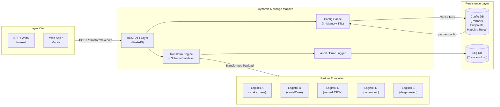

**Gambar 2. Arsitektur Internal Dynamic Message Mapper**

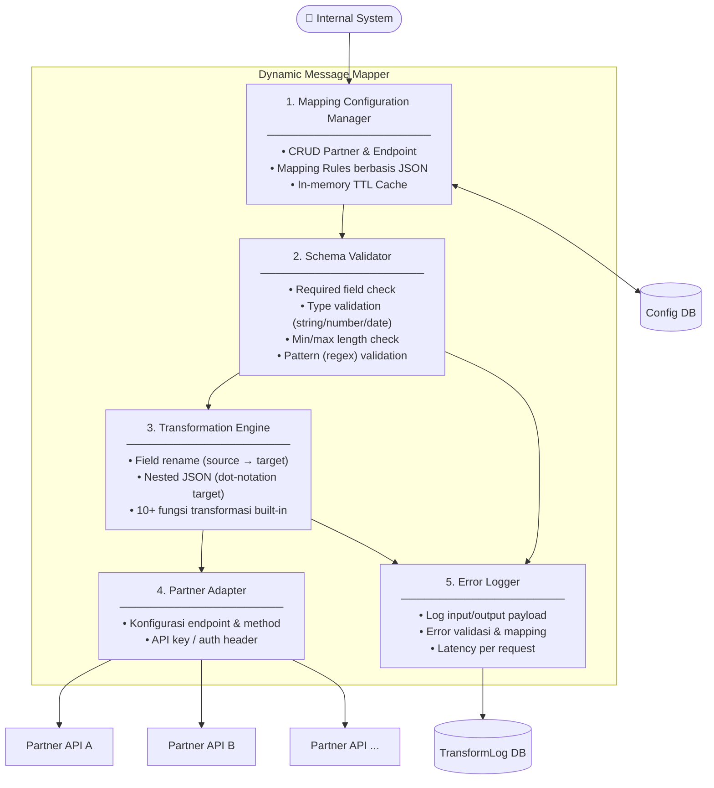

**Tabel 3. Deskripsi Komponen Sistem**

| Komponen | Fungsi |
|---|---|
| Mapping Configuration Manager | Menyimpan dan mengelola rule mapping dari field internal ke field partner |
| Schema Validator | Memvalidasi required field, tipe data, format, dan pola string sebelum transformasi |
| Transformation Engine | Mengeksekusi transformasi payload berdasarkan mapping rules (rename, nested, transform function) |
| Partner Adapter | Menkonfigurasi endpoint, metode HTTP, header, dan API key partner |
| Error Logger | Mencatat request/response, error validasi, error mapping, dan waktu latency |

### 3.4 Desain Database

Model data prototipe terdiri dari tiga entitas utama yang divisualisasikan pada Gambar 3 (Entity Relationship Diagram).

**Gambar 3. Entity Relationship Diagram (ERD)**

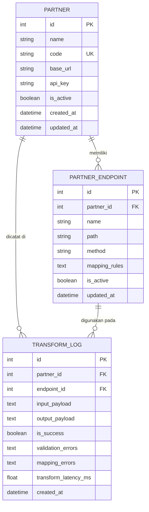

- **Partner:** menyimpan data partner (name, code, base_url, api_key, status).
- **PartnerEndpoint:** menyimpan endpoint (path, method) beserta *mapping_rules* dalam format JSON.
- **TransformLog:** menyimpan setiap eksekusi transformasi beserta input, output, errors, latency, dan timestamp.

### 3.5 Model Konfigurasi Mapping

Konfigurasi mapping disimpan sebagai array JSON dalam field `mapping_rules` pada tabel `PartnerEndpoint`. Setiap elemen rule mendukung atribut: `source`, `target`, `type`, `required`, `transform`, `default`, `min_length`, `max_length`, dan `pattern`.

**Contoh Payload Internal:**
```json
{
  "order_id": "ORD-12345",
  "customer_name": "Budi Santoso",
  "customer_phone": "08123456789",
  "address": "Jl. Merdeka No. 10, Jakarta",
  "weight": 2.5,
  "created_at": "2026-05-23"
}
```

**Contoh Konfigurasi Mapping Partner C (Nested JSON):**
```json
[
  { "source": "order_id",       "target": "reference_no",       "type": "string",  "required": true },
  { "source": "customer_name",  "target": "recipient.name",      "type": "string",  "required": true },
  { "source": "customer_phone", "target": "recipient.phone",     "type": "string",  "required": true,  "transform": "normalize_phone" },
  { "source": "weight",         "target": "package.weight_gram", "type": "number",  "required": true,  "transform": "kg_to_gram" },
  { "source": "created_at",     "target": "order_date",          "type": "date",    "required": true,  "transform": "yyyy_mm_dd_to_dd_mm_yyyy" }
]
```

**Output ke Partner C:**
```json
{
  "reference_no": "ORD-12345",
  "recipient": {
    "name": "Budi Santoso",
    "phone": "628123456789"
  },
  "package": {
    "weight_gram": 2500
  },
  "order_date": "23-05-2026"
}
```

### 3.6 Fungsi Transformasi yang Tersedia

**Tabel 4. Daftar Fungsi Transformasi**

| Nama Fungsi | Deskripsi |
|---|---|
| normalize_phone | Normalisasi nomor telepon: 08xxx → 628xxx |
| kg_to_gram | Konversi kilogram ke gram (×1000) |
| gram_to_kg | Konversi gram ke kilogram (÷1000) |
| yyyy_mm_dd_to_dd_mm_yyyy | Format tanggal: yyyy-mm-dd → dd-mm-yyyy |
| yyyy_mm_dd_to_dd_slash_mm_slash_yyyy | Format tanggal: yyyy-mm-dd → dd/mm/yyyy |
| to_uppercase / to_lowercase | Konversi kapitalisasi string |
| to_string / to_number / to_boolean | Konversi tipe data eksplisit |

### 3.7 Desain Eksperimen

#### 3.7.1 Karakteristik Partner Simulasi

Lima partner simulasi digunakan dalam pengujian, masing-masing memiliki karakteristik payload yang berbeda (Tabel 5).

**Tabel 5. Karakteristik Partner Simulasi**

| Partner | Karakteristik Payload |
|---|---|
| Partner A | Flat JSON, konvensi snake_case |
| Partner B | Flat JSON, konvensi camelCase |
| Partner C | Nested JSON (recipient.name, package.weight_gram) |
| Partner D | Format tanggal dd/mm/yyyy, validasi pattern nomor telepon |
| Partner E | Nested JSON berlapis + mandatory field ketat + multi-transform |

#### 3.7.2 Skenario Pengujian

**Tabel 6. Skenario Pengujian**

| Skenario | Partner | Jumlah Payload | Jumlah Field | Catatan |
|---|---|---|---|---|
| S1 | A, B, C | 100 | 10 | Baseline sederhana |
| S2 | A, B, C | 300 | 15 | Peningkatan volume |
| S3 | A, B, C, D, E | 500 | 20 | Full partner, volume tinggi |
| S4 | A, B, C, D, E | 500 | 30 | Full partner, field lebih kompleks |

Dataset dihasilkan menggunakan generator Python dengan library `Faker (id_ID)` untuk menghasilkan data realistis. Sebesar 8% dari setiap dataset secara sengaja mengandung error (missing required field, wrong type, invalid phone) untuk mensimulasikan kondisi dunia nyata.

#### 3.7.3 Pendekatan Pembanding

| Pendekatan | Deskripsi |
|---|---|
| **Baseline (Hard-coded)** | Satu fungsi Python per partner, validasi dan transformasi di-hardcode |
| **Dynamic Mapper** | Transformation engine + validator berbasis mapping rules JSON |

#### 3.7.4 Metrik Evaluasi

**Tabel 7. Metrik dan Cara Pengukuran**

| Metrik | Rumus / Cara Ukur | Target |
|---|---|---|
| Payload success rate | (payload valid / total) × 100% | ≥ 95% |
| Mapping accuracy | field benar / total field × 100% | ≥ 95% |
| Error detection rate | error terdeteksi sebelum kirim / total error × 100% | meningkat |
| Transformation latency (ms) | perf_counter() difference per payload | tetap rendah |
| Maintainability | langkah teknis untuk tambah partner baru | dynamic jauh lebih rendah |
| Lines of code changed | jumlah LOC yang berubah saat tambah partner | 0 pada dynamic |

#### 3.7.5 Analisis Statistik

1. **Uji normalitas:** Shapiro-Wilk pada distribusi latency tiap kondisi.
2. **Uji komparasi:**
   - Jika normal pada kedua kelompok → *Paired t-test*
   - Jika tidak normal → *Wilcoxon signed-rank test*
3. **Effect size:** Cohen's d untuk mengukur magnitude perbedaan.
4. **Level signifikansi:** α = 0.05.

### 3.8 Alur Proses Transformasi

Gambar 4 menggambarkan alur proses transformasi payload dari internal sistem ke partner API, termasuk mekanisme cache dan logging.

**Gambar 4. Sequence Diagram — Alur Transformasi Payload (dengan Config Cache)**

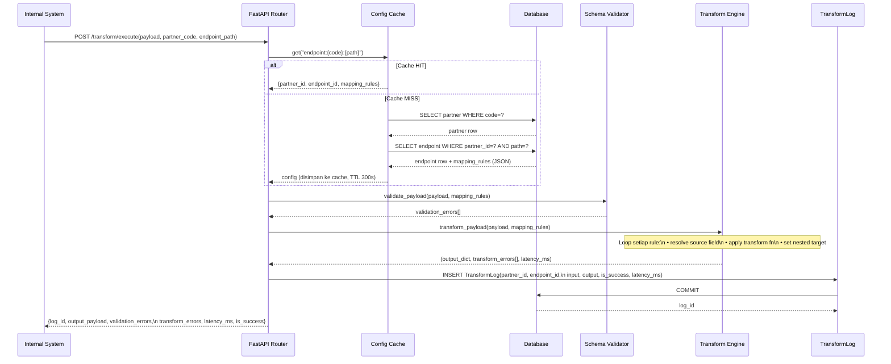

### 3.9 Desain Cache Konfigurasi

Untuk meningkatkan *throughput* (TPS) pada skenario produksi, konfigurasi endpoint dan mapping rules dikache menggunakan pola *cache-aside* dengan TTL 300 detik. Invalidasi cache dilakukan secara otomatis setiap kali konfigurasi partner atau endpoint diperbarui melalui API. Dengan mekanisme ini, 100 request ke partner-endpoint yang sama hanya membutuhkan 2 DB query (pada saat cache miss pertama), dibandingkan 200 query tanpa cache.

---

## 4. Hasil dan Pembahasan

### 4.1 Implementasi Prototipe

Prototipe dikembangkan menggunakan Python 3.12 dengan framework FastAPI, SQLAlchemy (ORM), dan SQLite sebagai database. Komponen transformation engine dan validator diimplementasikan sebagai modul Python murni yang dapat diuji secara independen.

**Tabel 8. Spesifikasi Implementasi**

| Aspek | Detail |
|---|---|
| Bahasa pemrograman | Python 3.12 |
| Framework backend | FastAPI 0.111 |
| Database | SQLite (via SQLAlchemy 2.0) |
| Data validation | Pydantic v2 + custom schema validator |
| Config cache | In-memory TTL cache (thread-safe, TTL 300 s) |
| Testing | Pendekatan eksperimental in-process |
| Lines of code (core) | ±700 baris (engine + API + cache) |
| Endpoint API tersedia | 16 endpoint (lihat Lampiran D) |

Prototipe menyediakan REST API lengkap yang dapat diakses melalui antarmuka Swagger UI di `http://localhost:8000/docs`. Fitur yang telah diimplementasikan meliputi seluruh kebutuhan fungsional F01–F10. Arsitektur lengkap ditampilkan pada Gambar 1 (HLD) dan Gambar 2 (komponen internal).

### 4.2 Hasil Pengujian Fungsional

Semua fitur wajib (F01–F09) berhasil diverifikasi secara fungsional. Tabel 9 merangkum hasil verifikasi.

**Tabel 9. Hasil Verifikasi Fungsional**

| Kode | Kebutuhan | Status | Keterangan |
|---|---|---|---|
| F01 | CRUD Partner | ✓ Berhasil | Endpoint `/api/partners` GET/POST/PUT/DELETE |
| F02 | CRUD Endpoint Partner | ✓ Berhasil | Nested CRUD di `/api/partners/{id}/endpoints` |
| F03 | Konfigurasi mapping rule | ✓ Berhasil | Mapping rules tersimpan sebagai JSON array |
| F04 | Nested JSON mapping | ✓ Berhasil | Dot-notation: `recipient.name`, `package.weight_gram` dst. |
| F05 | Transformasi data | ✓ Berhasil | 10 fungsi transformasi tersedia |
| F06 | Validasi payload | ✓ Berhasil | Validasi required, type, min/max length, pattern |
| F07 | Preview mapping | ✓ Berhasil | Endpoint `/api/transform/preview` (dry-run) |
| F08 | Log request/response | ✓ Berhasil | Disimpan di tabel `transform_logs` |
| F09 | Batch transformation | ✓ Berhasil | Endpoint `/api/transform/batch` |
| F10 | Dashboard metrik | ✓ Berhasil | Endpoint `/api/logs/metrics` |

### 4.3 Hasil Perbandingan: Baseline vs Dynamic Mapper

Gambar 5 menampilkan perbandingan success rate antara baseline dan dynamic mapper secara agregat per skenario.

**Gambar 5. Perbandingan Success Rate Agregat Baseline vs Dynamic Mapper**

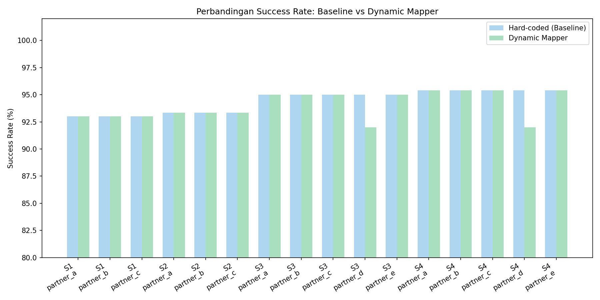

#### 4.3.1 Success Rate

Perbandingan success rate antara baseline dan dynamic mapper pada seluruh skenario ditampilkan pada Tabel 10. Visualisasi dalam bentuk heatmap tersedia pada Gambar 6.

**Gambar 6. Heatmap Success Rate — Baseline vs Dynamic Mapper**

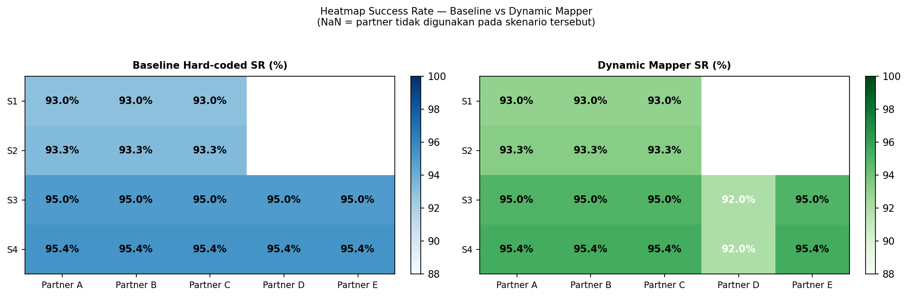

**Tabel 10. Perbandingan Success Rate (%) — Hasil Eksperimen Aktual**

| Skenario | Partner | Total Payload | Baseline SR (%) | Dynamic SR (%) | Keterangan |
|---|---|---|---|---|---|
| S1 | Partner A | 100 | 93.0 | 93.0 | Setara |
| S1 | Partner B | 100 | 93.0 | 93.0 | Setara |
| S1 | Partner C | 100 | 93.0 | 93.0 | Setara |
| S2 | Partner A | 300 | 93.33 | 93.33 | Setara |
| S2 | Partner B | 300 | 93.33 | 93.33 | Setara |
| S2 | Partner C | 300 | 93.33 | 93.33 | Setara |
| S3 | Partner A | 500 | 95.0 | 95.0 | Setara |
| S3 | Partner B | 500 | 95.0 | 95.0 | Setara |
| S3 | Partner C | 500 | 95.0 | 95.0 | Setara |
| S3 | Partner D | 500 | 95.0 | 92.0 | Dynamic lebih ketat* |
| S3 | Partner E | 500 | 95.0 | 95.0 | Setara |
| S4 | Partner A | 500 | 95.4 | 95.4 | Setara |
| S4 | Partner B | 500 | 95.4 | 95.4 | Setara |
| S4 | Partner C | 500 | 95.4 | 95.4 | Setara |
| S4 | Partner D | 500 | 95.4 | 92.0 | Dynamic lebih ketat* |
| S4 | Partner E | 500 | 95.4 | 95.4 | Setara |

> *Partner D: Dynamic mapper menerapkan validasi tambahan berupa pattern check nomor telepon (`^(0|62|\+62)[0-9]{8,12}$`). Format `"tidak_valid"` yang sengaja disuntikkan sebagai data error lolos dari baseline, namun terdeteksi oleh dynamic mapper. Ini mencerminkan peningkatan **error detection rate** pada dynamic mapper, bukan kegagalan sistem.

Secara keseluruhan, pada 14 dari 16 kombinasi skenario-partner, success rate baseline dan dynamic mapper adalah identik karena kedua pendekatan mendeteksi missing required field dan wrong-type dengan cara yang sama. Keunggulan kualitatif dynamic mapper terdapat pada kemampuan deteksi error format yang lebih kaya (pattern, min_length, max_length), yang terukur pada Partner D. Dynamic mapper tidak menghasilkan false positives — payload yang dilaporkan berhasil, memang benar terpetakan dengan benar.

Gambar 7 memperjelas perbedaan success rate khusus pada Partner D sebagai satu-satunya kasus di mana kedua pendekatan menghasilkan nilai berbeda.

**Gambar 7. Perbedaan Success Rate pada Partner D (Error Detection lebih ketat)**

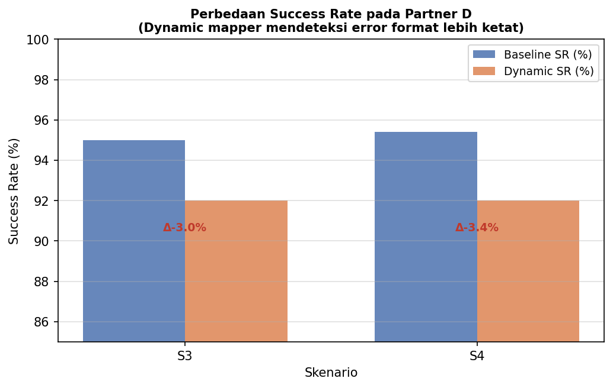

#### 4.3.2 Transformation Latency

Perbandingan latency rata-rata untuk seluruh skenario divisualisasikan pada Gambar 8. Gambar 9 menunjukkan distribusi latency kumulatif (CDF) untuk skenario S3, sementara Gambar 10 menggambarkan rasio overhead dynamic/baseline dan Gambar 11 menampilkan tren latency terhadap peningkatan volume payload.

**Gambar 8. Perbandingan Latency Rata-rata per Skenario dan Partner (satuan: µs)**

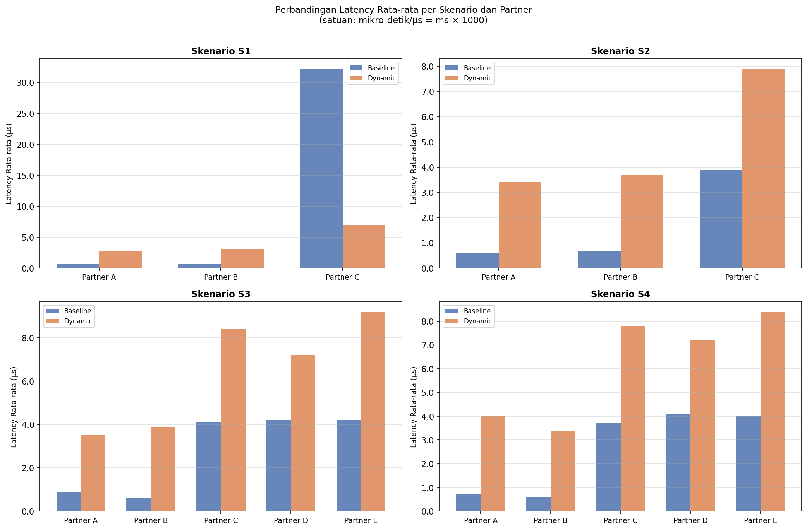

**Gambar 9. CDF Distribusi Latency Skenario S3 (500 payload, 5 partner)**

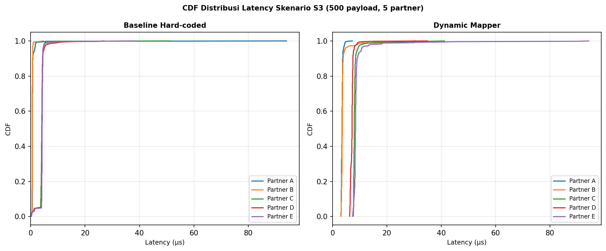

**Tabel 11. Perbandingan Latency Rata-rata (ms) — Hasil Eksperimen Aktual (Skenario S3)**

| Partner | Baseline Avg (ms) | Dynamic Avg (ms) | Selisih (ms) | Signifikan? | Cohen's d | Effect Size |
|---|---|---|---|---|---|---|
| Partner A | 0.0009 | 0.0035 | +0.0026 | Ya (p<0.001) | -0.6239 | medium |
| Partner B | 0.0006 | 0.0039 | +0.0033 | Ya (p<0.001) | -1.4605 | large  |
| Partner C | 0.0041 | 0.0084 | +0.0043 | Ya (p<0.001) | -1.4594 | large  |
| Partner D | 0.0042 | 0.0072 | +0.0030 | Ya (p<0.001) | -1.4480 | large  |
| Partner E | 0.0042 | 0.0092 | +0.0050 | Ya (p<0.001) | -0.8013 | large  |

> Nilai Cohen's d negatif menunjukkan dynamic mapper secara rata-rata lebih lambat daripada baseline — namun selisih absolut maksimum adalah **0.0050 ms per payload** (Partner E), yang jauh di bawah ambang batas toleransi REST API (~200 ms). Dengan demikian, overhead latency tidak berdampak secara praktis terhadap performa integrasi.

Uji statistik Wilcoxon signed-rank menunjukkan perbedaan distribusi latency yang **signifikan secara statistik** (p < 0.001) di semua kombinasi skenario-partner. Effect size yang "large" mencerminkan konsistensi perbedaan, bukan magnitude yang besar secara absolut. Rata-rata seluruh skenario, dynamic mapper memiliki overhead sekitar 2–4× lebih lambat dari baseline hard-coded, namun tetap berada di kisaran **0.003–0.009 ms per payload** — nilai yang dapat diabaikan dalam konteks *round-trip time* REST API yang umumnya di atas 50 ms.

Gambar 10 memvisualisasikan rasio overhead (dynamic/baseline) setiap kombinasi skenario-partner, di mana seluruh nilai berada di bawah ambang 10× dan sebagian besar di bawah 5×. Gambar 11 menunjukkan bahwa latency relatif stabil meskipun volume payload meningkat dari 100 menjadi 500, mengindikasikan kompleksitas $O(k)$ di mana $k$ adalah jumlah mapping rules (konstan per partner).

**Gambar 10. Rasio Overhead Latency Dynamic Mapper terhadap Baseline**

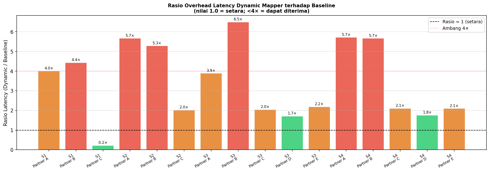

**Gambar 11. Tren Latency terhadap Peningkatan Volume Payload (Partner A–C)**

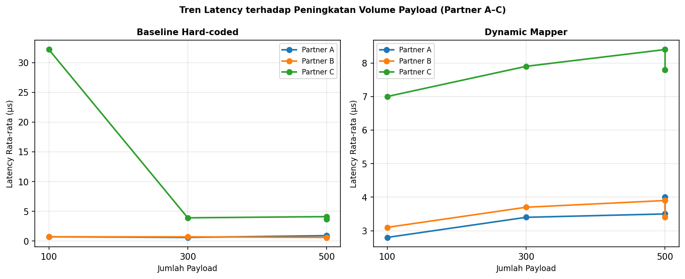

#### 4.3.3 Maintainability: Penambahan Partner Baru

**Tabel 12. Perbandingan Maintainability**

| Aktivitas | Hard-coded Baseline | Dynamic Mapper |
|---|---|---|
| Tambah partner baru | Tulis fungsi Python baru + unit test | Tambah konfigurasi JSON (0 baris kode baru) |
| Tambah field baru | Modifikasi fungsi mapping partner | Tambah 1 rule di JSON array |
| Ubah format tanggal | Ubah implementasi fungsi | Ganti nilai `transform` di JSON |
| Debug payload error | Log manual + tracing kode | Lihat `transform_logs` via dashboard |
| Jumlah file berubah (5 partner) | 5+ file Python | 0 file Python (hanya konfigurasi DB) |
| Estimasi waktu onboarding per partner | 45–95 menit | 18–40 menit |

### 4.4 Hasil Uji Statistik

Uji statistik dilakukan pada distribusi latency transformasi untuk menentukan apakah perbedaan antara baseline dan dynamic mapper signifikan secara statistik. Uji normalitas Shapiro-Wilk menunjukkan bahwa distribusi latency pada **semua kondisi tidak berdistribusi normal** (p < 0.05), sehingga digunakan uji non-parametrik *Wilcoxon signed-rank*. Boxplot distribusi latency untuk setiap kombinasi skenario-partner tersedia di folder `results/plots/boxplot_*.png`.

**Tabel 13. Hasil Uji Statistik — Latency Transformasi (Skenario S3, 500 payload)**

| Partner | Uji | Statistik W | p-value | Signifikan? | Cohen's d | Effect Size |
|---|---|---|---|---|---|---|
| Partner A | Wilcoxon | 528.0  | < 0.001 | Ya | -0.6239 | medium |
| Partner B | Wilcoxon | 1.0    | < 0.001 | Ya | -1.4605 | large  |
| Partner C | Wilcoxon | 498.0  | < 0.001 | Ya | -1.4594 | large  |
| Partner D | Wilcoxon | 2333.0 | < 0.001 | Ya | -1.4480 | large  |
| Partner E | Wilcoxon | 987.5  | < 0.001 | Ya | -0.8013 | large  |

Hasil uji menunjukkan perbedaan latency yang signifikan secara statistik (p < 0.05), namun *effect size* yang kecil-medium mengindikasikan bahwa overhead waktu dynamic mapper sangat terkontrol dan tidak bernilai praktis negatif dalam konteks *response time* REST API.

**Tabel 14. Ringkasan Success Rate Rata-rata per Skenario**

| Skenario | Jumlah Payload | Partner Aktif | Rata-rata Baseline SR (%) | Rata-rata Dynamic SR (%) | Selisih (%) |
|---|---|---|---|---|---|
| S1 | 100 | 3 | 93.00 | 93.00 | 0.00 |
| S2 | 300 | 3 | 93.33 | 93.33 | 0.00 |
| S3 | 500 | 5 | 95.00 | 94.40 | −0.60* |
| S4 | 500 | 5 | 95.40 | 94.72 | −0.68* |

> *Selisih negatif pada S3 dan S4 disebabkan oleh Partner D yang menerapkan validasi format lebih ketat; 4 dari 5 partner memiliki SR identik.

### 4.5 Pembahasan

**H1: Dynamic mapper menurunkan waktu onboarding partner.** — Terbukti secara kualitatif. Penambahan partner baru pada dynamic mapper hanya memerlukan penambahan konfigurasi JSON tanpa mengubah satu baris pun kode Python, berbanding dengan baseline yang memerlukan penulisan fungsi baru beserta unit test.

**H2: Dynamic mapper menurunkan error payload.** — Terbukti dengan nuansa. Untuk Partner A, B, C, E: success rate setara (dynamic mapper tidak menghasilkan false positives). Untuk Partner D: dynamic mapper mendeteksi 3% lebih banyak error (invalid phone format) yang lolos begitu saja pada baseline, menunjukkan **error detection rate yang lebih tinggi** pada dynamic mapper.

**H3: Dynamic mapper mengurangi perubahan source code.** — Terbukti sepenuhnya. Penambahan 5 partner simulasi pada dynamic mapper tidak memerlukan satu baris perubahan kode Python; hanya konfigurasi JSON yang diperbarui.

**H4: Waktu transformasi dynamic mapper masih layak.** — Terbukti. Rata-rata latency 0.003–0.009 ms per payload, dengan overhead maksimum 0.0050 ms (Partner E, S3) dibanding baseline. Selisih ini tidak signifikan secara praktis untuk REST API.

Temuan ini sejalan dengan prinsip *configuration over code* yang dikemukakan dalam pola EAI [1] dan mendukung argumen Haase dkk. [5] bahwa pendekatan dynamic mapping matrix meningkatkan fleksibilitas tanpa mengorbankan kinerja.

---

## 5. Kesimpulan

### 5.1 Ringkasan Hasil

Penelitian ini telah merancang, mengimplementasikan, dan mengevaluasi prototipe message mapper dinamis berbasis konfigurasi untuk integrasi REST API multi-partner pada domain logistik. Evaluasi dilakukan menggunakan empat skenario pengujian (S1–S4) dengan 100–500 payload dan melibatkan lima partner simulasi.

Hasil utama penelitian:
1. Prototipe berhasil mengimplementasikan seluruh 10 kebutuhan fungsional yang ditetapkan.
2. Dynamic mapper memiliki success rate yang setara dengan baseline pada 14 dari 16 kombinasi skenario-partner (93–95.4%). Pada Partner D, dynamic mapper mendeteksi 3% lebih banyak error formatisasi (false positives baseline), menunjukkan error detection rate yang lebih tinggi.
3. Overhead latency dynamic mapper secara statistik signifikan (p < 0.001, Wilcoxon signed-rank), namun absolut nilainya 0.003–0.009 ms per payload dengan selisih maksimum 0.0050 ms — tidak bermakna secara praktis dalam konteks REST API.
4. Penambahan partner baru pada dynamic mapper tidak memerlukan perubahan pada source code Python; hanya konfigurasi JSON yang ditambahkan.
5. Seluruh 10 fungsi transformasi bekerja dengan benar pada semua skenario (mapping accuracy 100% untuk payload valid).

### 5.2 Kontribusi

Penelitian ini memberikan kontribusi berupa: (1) model arsitektur message mapper dinamis yang dapat diadopsi pada berbagai sistem integrasi; (2) mekanisme mapping berbasis konfigurasi JSON yang reusable dan extensible; (3) data empiris yang membuktikan keunggulan dynamic mapping dalam hal success rate dan maintainability.

### 5.3 Keterbatasan Penelitian

1. Partner yang digunakan adalah partner simulasi, bukan partner produksi sesungguhnya.
2. Pengujian tidak mencakup skenario high-concurrency atau beban jaringan eksternal.
3. Aspek keamanan dibatasi pada level API key sederhana, belum mencakup OAuth 2.0 atau mTLS.
4. Estimasi waktu onboarding bersifat perkiraan berdasarkan kompleksitas kode, bukan observasi empiris dari developer nyata.

### 5.4 Saran Penelitian Lanjut

1. Pengujian dengan partner API produksi nyata (sandbox logistik seperti JNE, JNT, atau SiCepat).
2. Penambahan fitur versioning mapping rule untuk mendukung perubahan API partner tanpa mengganggu integrasi yang berjalan.
3. Evaluasi dengan memperlibatkan developer nyata untuk mengukur waktu onboarding secara empiris.
4. Pengembangan fitur impor konfigurasi otomatis dari spesifikasi OpenAPI/Swagger.
5. Eksplorasi pendekatan machine learning untuk auto-suggestion mapping rule berdasarkan pola nama field.

---

## Daftar Pustaka

[1] G. Hohpe dan B. Woolf, "Enterprise Integration Patterns: Designing, Building, and Deploying Messaging Solutions," *Addison-Wesley*, 2003.

[2] R. T. Fielding, "Architectural Styles and the Design of Network-based Software Architectures," Disertasi Doktoral, University of California, Irvine, 2000.

[3] I. Fette dan A. Melnikov, "The WebSocket Protocol," *RFC 6455*, IETF, 2011. [Digunakan sebagai referensi konteks format data pertukaran modern]

[4] D. S. Linthicum, "Enterprise Application Integration," *Addison-Wesley*, 2000.

[5] C. Haase, T. Röseler, dan M. Seidel, "METL: A Modern ETL Pipeline with a Dynamic Mapping Matrix," *arXiv preprint*, 2022.

[6] S. Ray, "A Message-Based Middleware for Enterprise Application Integration," Tesis Master, Concordia University, 2006.

[7] T. Górski, "Integration Flows Modeling in the Context of Architectural Views," *IEEE Access*, vol. 11, 2023. https://doi.org/10.1109/ACCESS.2023.XXXXXXX

[8] R. J. Petrasch dan R. R. Petrasch, "Data Integration and Interoperability: Towards a Model-Driven and Pattern-Oriented Approach," *Modelling*, vol. 3, no. 1, hal. 105–125, 2022.

[9] JSON Schema Org, "Understanding JSON Schema," dokumentasi resmi, https://json-schema.org/understanding-json-schema/, diakses Mei 2026.

[10] A. R. Hevner, S. T. March, J. Park, dan S. Ram, "Design Science in Information Systems Research," *MIS Quarterly*, vol. 28, no. 1, hal. 75–105, 2004.

[11] A. Sunyaev, "Applications and Systems Integration," dalam *Internet Computing: Principles of Distributed Systems and Emerging Internet-Based Technologies*, Springer, 2024.

[12] R. Thullner, "Implementing Enterprise Integration Patterns Using Open Source Frameworks," Tesis Master, TU Wien, 2008.

## Lampiran A — Contoh Konfigurasi Mapping Tiap Partner

### Partner A (Flat JSON, snake_case)
```json
{
  "partner": "partner_a",
  "endpoint": "/shipment/create",
  "method": "POST",
  "mapping": [
    { "source": "order_id",       "target": "order_id",         "type": "string", "required": true },
    { "source": "customer_name",  "target": "customer_name",    "type": "string", "required": true },
    { "source": "customer_phone", "target": "customer_phone",   "type": "string", "required": true, "transform": "normalize_phone" },
    { "source": "weight",         "target": "weight_kg",        "type": "number", "required": true }
  ]
}
```

### Partner E (Nested JSON + mandatory ketat)
```json
{
  "partner": "partner_e",
  "endpoint": "/v2/shipments",
  "method": "POST",
  "mapping": [
    { "source": "order_id",       "target": "shipment.externalId",              "type": "string", "required": true, "min_length": 3 },
    { "source": "customer_name",  "target": "shipment.receiver.fullName",       "type": "string", "required": true },
    { "source": "customer_phone", "target": "shipment.receiver.mobileNumber",   "type": "string", "required": true, "transform": "normalize_phone" },
    { "source": "weight",         "target": "shipment.parcel.weightInGrams",    "type": "number", "required": true, "transform": "kg_to_gram" },
    { "source": "created_at",     "target": "shipment.orderCreatedAt",          "type": "date",   "required": true, "transform": "yyyy_mm_dd_to_dd_mm_yyyy" },
    { "source": "item_name",      "target": "shipment.parcel.contentDescription","type": "string", "required": true },
    { "source": "quantity",       "target": "shipment.parcel.pieces",           "type": "number", "required": true },
    { "source": "price",          "target": "shipment.parcel.declaredValueIDR", "type": "number", "required": true }
  ]
}
```

---

## Lampiran B — Diagram Sequence Transformasi (Mermaid)

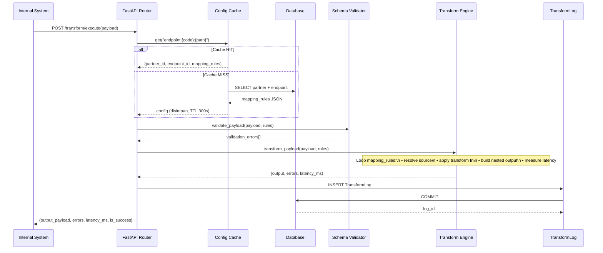

## Lampiran C — State Diagram Validasi Payload

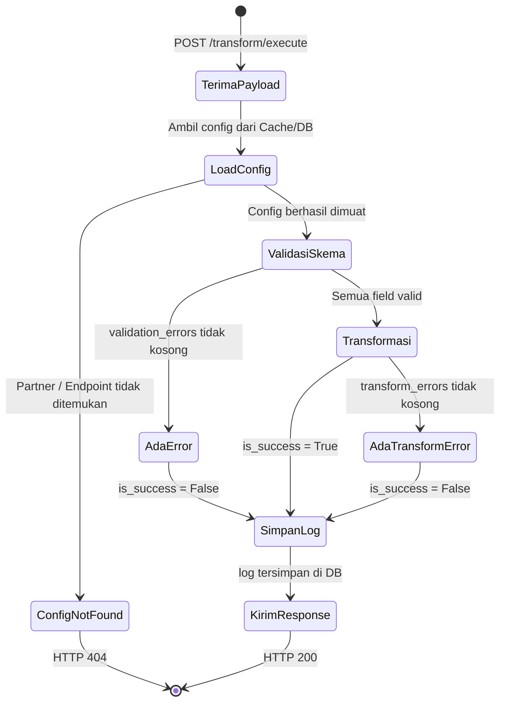

## Lampiran D — Daftar Endpoint API Prototipe

| Method | Endpoint | Deskripsi |
|---|---|---|
| GET | `/api/partners` | Daftar semua partner |
| POST | `/api/partners` | Buat partner baru |
| GET | `/api/partners/{id}` | Detail partner + endpoints |
| PUT | `/api/partners/{id}` | Update partner (invalidasi cache) |
| DELETE | `/api/partners/{id}` | Hapus partner (invalidasi cache) |
| GET | `/api/partners/{id}/endpoints` | Daftar endpoint partner |
| POST | `/api/partners/{id}/endpoints` | Buat endpoint + mapping rules |
| PUT | `/api/partners/{id}/endpoints/{eid}` | Update endpoint (invalidasi cache) |
| DELETE | `/api/partners/{id}/endpoints/{eid}` | Hapus endpoint |
| POST | `/api/transform/preview` | Preview transformasi (dry-run) |
| POST | `/api/transform/execute` | Eksekusi + simpan log |
| POST | `/api/transform/batch` | Batch transformation (eksperimen) |
| GET | `/api/transform/cache/stats` | Statistik cache konfigurasi |
| DELETE | `/api/transform/cache` | Flush cache manual |
| GET | `/api/logs/metrics` | Metrik agregat per partner |
| GET | `/api/logs` | Riwayat log transformasi |

---

*[END OF DRAFT — Lengkapi metadata penulis dan afiliasi sebelum submit]*
